# How Wappa Works (The Simple Version)

Don't worry, this isn't a computer science lecture. You just need to understand how a WhatsApp message gets to your code and back. That's it.

## The Big Picture (30 Seconds)

When someone sends a WhatsApp message to your conversational app:

```
👤 User sends message → 🌐 WhatsApp → 📡 Your server → 🎯 Your code → 📤 Response back
```

**Your code goes in one place:** the event handler. Everything else is handled for you.

That's the whole story. Let's see what happens under the hood.

---

## Message Flow: From WhatsApp to Your Code

Here's exactly what happens when someone sends a message to your conversational app:

### 1. Incoming Message Flow
!!! Info 
    Zoom in the UML Diagram

```mermaid
sequenceDiagram
    participant User as 👤 WhatsApp User
    participant WA as 🌐 WhatsApp API
    participant Route as 📡 Webhook Route
    participant Middleware as 🔧 Middleware Layer
    participant Controller as 🎯 Webhook Controller
    participant Processor as ⚙️ Message Processor
    participant Dispatcher as 🎪 Event Dispatcher
    participant Handler as 👨‍💻 Your Event Handler
    participant Messenger as 📤 Messenger Service

    User->>WA: Sends WhatsApp message
    WA->>Route: POST /webhook/messenger/{tenant_id}/whatsapp
    Route->>Middleware: Extract tenant_id & context
    Middleware->>Controller: Request with tenant context
    
    Controller->>Processor: Create Universal Webhook
    Processor->>Controller: IncomingMessageWebhook
    
    Controller->>Controller: Inject dependencies<br/>(messenger, cache_factory)
    Controller->>Dispatcher: dispatch_universal_webhook()
    Dispatcher->>Handler: handle_message(webhook)
    
    Handler->>Messenger: send_text() / send_button_message()
    Messenger->>WA: WhatsApp API call
    WA->>User: Message delivered
```

<div style="width: 100%; overflow-x: auto;">



</div>

<style>
.md-content .mermaid {
    text-align: center;
}
.md-content .mermaid svg {
    max-width: none !important;
    width: 1200px !important;
    height: auto !important;
    min-height: 600px !important;
}
@media (max-width: 1200px) {
    .md-content .mermaid svg {
        width: 100% !important;
        min-width: 800px !important;
    }
}
</style>

**What each step does:**

1. **🌐 WhatsApp API** receives the user's message and sends it to your webhook URL
2. **📡 Webhook Route** validates the HTTP request and extracts the tenant ID from the URL
3. **🔧 Middleware Layer** sets up security context and request tracking  
4. **🎯 Webhook Controller** creates fresh dependencies for this specific request
5. **⚙️ Message Processor** converts raw WhatsApp JSON into a clean `IncomingMessageWebhook`
6. **🎪 Event Dispatcher** routes the webhook to your event handler
7. **👨‍💻 Your Event Handler** processes the message and sends responses
8. **📤 Messenger Service** handles the WhatsApp API calls back to the user

### 2. Status Update Flow

Status updates tell you when messages are delivered, read, or failed:

```mermaid
sequenceDiagram
    participant WA as 🌐 WhatsApp API
    participant Route as 📡 Webhook Route
    participant Controller as 🎯 Webhook Controller
    participant Processor as ⚙️ Status Processor
    participant Dispatcher as 🎪 Event Dispatcher
    participant Handler as 👨‍💻 Your Event Handler

    WA->>Route: POST /webhook/messenger/{tenant_id}/whatsapp<br/>(status update)
    Route->>Controller: Status webhook payload
    Controller->>Processor: Create Universal Webhook
    Processor->>Controller: StatusWebhook
    Controller->>Dispatcher: dispatch_universal_webhook()
    Dispatcher->>Handler: handle_status(webhook)
    Handler->>Handler: Optional: Update delivery tracking
```



### 3. Error Webhook Flow

Error webhooks notify you when something goes wrong with message delivery:

```mermaid
sequenceDiagram
    participant WA as 🌐 WhatsApp API
    participant Route as 📡 Webhook Route
    participant Controller as 🎯 Webhook Controller
    participant Processor as ⚙️ Error Processor
    participant Dispatcher as 🎪 Event Dispatcher
    participant Handler as 👨‍💻 Your Event Handler

    WA->>Route: POST /webhook/messenger/{tenant_id}/whatsapp<br/>(error notification)
    Route->>Controller: Error webhook payload
    Controller->>Processor: Create Universal Webhook
    Processor->>Controller: ErrorWebhook
    Controller->>Dispatcher: dispatch_universal_webhook()
    Dispatcher->>Handler: handle_error(webhook)
    Handler->>Handler: Optional: Error recovery logic
```



---

## The Magic: Dependency Injection (In Practice)

Here's the cool part: **Wappa automatically gives your event handler everything it needs** to process messages.

### Before Your Code Runs

When a webhook arrives, Wappa automatically creates and injects:

```python
# This happens automatically - you don't write this code!

# 1. Create messenger for this specific tenant
messenger = await messenger_factory.create_messenger(
    platform=PlatformType.WHATSAPP,
    tenant_id=tenant_id  # Different per request!
)

# 2. Create cache factory for user state management
cache_factory = create_cache_factory(cache_type)
cache = cache_factory(tenant_id=tenant_id, user_id=user_id)

# 3. Inject into your event handler
your_event_handler.messenger = messenger        # Send messages
your_event_handler.cache_factory = cache_factory  # Remember things
your_event_handler.logger = logger             # Log events

# 4. Now call your code
await your_event_handler.handle_message(webhook)
```

### In Your Event Handler

You just use the injected dependencies - they're ready to go:

```python
from wappa import WappaEventHandler

class MyApp(WappaEventHandler):
    async def handle_message(self, webhook):
        # These are automatically available:
        
        # ✅ self.messenger - Send messages back to WhatsApp
        await self.messenger.send_text("Hello!", webhook.user.user_id)
        
        # ✅ self.cache_factory - Remember user conversations
        user_cache = self.cache_factory.create_user_cache()
        await user_cache.set("last_message", webhook.get_message_text())
        
        # ✅ self.logger - Log events with context
        self.logger.info(f"Processed message from {webhook.user.profile_name}")
```

**That's it!** You never create these objects yourself - Wappa handles all the plumbing.

---

## Why This Architecture Matters

### Multi-Tenant by Default

Each webhook gets fresh dependencies with the correct tenant context:

```python
# Request 1: Company A's WhatsApp number
# → messenger configured for Company A
# → cache isolated to Company A's data

# Request 2: Company B's WhatsApp number  
# → messenger configured for Company B
# → cache isolated to Company B's data
```

**No data leaks, no configuration confusion.** Each request is completely isolated.

### Performance & Reliability

- **⚡ Immediate Response**: WhatsApp gets an instant "200 OK" response
- **🔄 Background Processing**: Your code runs asynchronously without timeout pressure
- **🔧 Connection Pooling**: Shared HTTP connections for efficiency
- **🛡️ Error Isolation**: One tenant's errors don't affect others

### Scalability Without Complexity

```python
# This works for 1 user:
app = Wappa()

# This works for 1,000,000 users:
app = Wappa(cache="redis")

# Same code, same patterns. Just change the cache type.
```

**No architectural changes needed** as your app grows.

---

## Your Event Handler: The Star of the Show

Your `WappaEventHandler` is where all your business logic lives. It's the only class you need to understand:

```python
from wappa import WappaEventHandler

class MyConversationalApp(WappaEventHandler):
    async def handle_message(self, webhook):
        """Handle incoming messages - the main event"""
        # Your conversational logic goes here
        pass
    
    async def handle_status(self, webhook):
        """Optional: Handle delivery/read status updates"""
        # Track message delivery if needed
        pass
    
    async def handle_error(self, webhook):
        """Optional: Handle WhatsApp API errors"""
        # Error recovery logic if needed
        pass
```

**Three methods. That's your entire API.**

Most conversational apps only implement `handle_message()`. The others are optional for advanced use cases.

### What's in a Webhook?

The `webhook` parameter contains everything WhatsApp sends you, cleaned up and organized:

```python
# User information
webhook.user.user_id        # "1234567890" 
webhook.user.profile_name   # "John Doe"
webhook.user.tenant_id      # Your company/tenant ID

# Message content  
webhook.get_message_text()     # "Hello app!"
webhook.get_message_type_name() # "text", "image", "audio", etc.
webhook.message.message_id     # "wamid.abc123..."

# Interactive responses (when user clicks buttons)
webhook.interactive.button_reply.id  # "button_1"
webhook.interactive.button_reply.title # "Yes"
```

**Clean, simple, predictable.** No digging through nested JSON structures.

---

## The Complete Architecture

Here's how all the Wappa components work together as a system:

```mermaid
flowchart TD
    subgraph External [🌐 External Services]
        User[👤 WhatsApp User]
        WA[📱 WhatsApp Business API]
    end
    
    subgraph WappaFramework [🏗️ Wappa Framework]
        subgraph HTTP [📡 HTTP Layer]
            Route["🌍 Webhook Routes<br/><br/>POST /webhook/messenger/<br/>tenant_id/whatsapp<br/><br/>• URL Pattern Matching<br/>• Request Validation<br/>• Tenant Extraction"]
            Middleware["🔧 FastAPI Middleware<br/><br/>• Tenant Context Setup<br/>• Security Headers<br/>• Request Tracking<br/>• Error Boundaries"]
        end
        
        subgraph Processing [⚙️ Processing Layer]
            Controller["🎯 WebhookController<br/><br/>• Per-Request Dependencies<br/>• Multi-tenant Isolation<br/>• Async Request Handling<br/>• Business Logic Routing"]
            Processor["🔄 WhatsApp Processor<br/><br/>• Raw JSON -> Universal<br/>Webhook<br/>• Schema Validation<br/>• Message Type Detection<br/>• Context Enrichment"]
        end
        
        subgraph Core [🎪 Core Event System]
            Dispatcher["🎪 Event Dispatcher<br/><br/>• Handler Method Routing<br/>• Exception Management<br/>• Performance Monitoring<br/>• Result Aggregation"]
            UW["📋 Universal Webhook<br/><br/>• IncomingMessageWebhook<br/>• StatusWebhook<br/>• ErrorWebhook<br/>• Platform Abstraction"]
        end
        
        subgraph Dependencies [💉 Injected Dependencies]
            Messenger["📤 Messenger Service<br/><br/>• WhatsApp Business API<br/>• Message Composition<br/>• Media Upload/Download<br/>• Template Management"]
            Cache["💾 Cache Factory<br/><br/>• User State Persistence<br/>• Session Management<br/>• Multi-backend (Memory/Redis)<br/>• Tenant Isolation"]
            Logger["📝 Context Logger<br/><br/>• Structured JSON Logging<br/>• Request Tracing<br/>• Performance Metrics<br/>• Multi-tenant Context"]
        end
    end
    
    subgraph UserCode [👨‍💻 Your Application]
        Handler["🎯 Your Event Handler<br/><br/>• handle_message()<br/>• handle_status()<br/>• handle_error()<br/>• Business Logic Entry Point"]
        Business["🏢 Your Business Logic<br/><br/>• Conversation Flow<br/>Management<br/>• Data Processing & Analysis<br/>• External API Integrations<br/>• Custom Application Features"]
    end
    
    %% Message Flow
    User -->|Sends Message| WA
    WA -->|Webhook POST| Route
    Route --> Middleware
    Middleware --> Controller
    Controller --> Processor
    Processor --> UW
    UW --> Dispatcher
    Dispatcher --> Handler
    Handler --> Business
    
    %% Dependency Injection
    Controller -.->|Injects| Messenger
    Controller -.->|Injects| Cache
    Controller -.->|Injects| Logger
    
    %% Response Flow
    Handler -.->|Uses| Messenger
    Handler -.->|Uses| Cache
    Handler -.->|Uses| Logger
    Messenger -->|API Calls| WA
    WA -->|Delivers| User
    
    %% Clean outline-only styling for professional appearance
    classDef userCode fill:transparent,stroke:#1976d2,stroke-width:3px;
    classDef wappaCore fill:transparent,stroke:#7b1fa2,stroke-width:2px;
    classDef external fill:transparent,stroke:#f57c00,stroke-width:2px;
    classDef dependency fill:transparent,stroke:#388e3c,stroke-width:2px;
    
    class Handler,Business userCode
    class Route,Middleware,Controller,Processor,Dispatcher,UW wappaCore
    class User,WA external
    class Messenger,Cache,Logger dependency
```



**System Architecture Layers:**

- **🌐 External Services** (Orange) - WhatsApp Business API and users outside your control
- **🏗️ Wappa Framework** (Purple) - Handles all the complex infrastructure automatically  
- **💉 Injected Dependencies** (Green) - Ready-to-use services provided to your code
- **👨‍💻 Your Application** (Blue) - Just your event handler and business logic

**The flow is simple:** Messages come in → Wappa processes them → Your handler gets called with everything ready to use → You send responses back.

---

## What You Need to Remember

1. **📱 Messages come in** → Wappa converts them to clean webhook objects
2. **🎯 Your handler processes them** → All dependencies are injected automatically  
3. **📤 You send responses** → Using the pre-configured messenger
4. **✅ Done** → Wappa handles all the HTTP/API complexity

That's literally it. Everything else is handled for you.

### Want More Details?

Now that you understand the flow, dive deeper into specific areas:

- **[Event System Guide](event-system.md)** - Master webhook handling and state management

### Ready to Build?

- **[Quick Start](../quickstart.md)** - Create your first conversational app in 10 minutes

---

<div style="text-align: center; margin: 3rem 0; padding: 2rem; border: 1px solid var(--md-default-fg-color--lightest); border-radius: 12px; background: transparent;">
    <h3 style="margin: 0 0 1rem 0;">🧠 Understanding Achieved!</h3>
    <p style="margin: 0 0 1.5rem 0; opacity: 0.8;">
        You now understand how Wappa works. Time to build something amazing!
    </p>
    
    <a href="../quickstart" class="md-button md-button--primary" style="
        background: linear-gradient(135deg, #667eea 0%, #764ba2 100%);
        border: none;
        border-radius: 8px;
        padding: 12px 32px;
        font-size: 16px;
        font-weight: 600;
        text-decoration: none;
        color: white;
        box-shadow: 0 4px 12px rgba(102, 126, 234, 0.3);
        transition: all 0.3s ease;
        display: inline-block;
        margin: 0.5rem;
    ">🚀 Build Your First App</a>
</div>