# State Management for Conversational Apps

*Why your WhatsApp conversational app needs memory, and how Wappa makes it simple*

---

## The Memory Problem

Imagine calling customer service and having to re-introduce yourself every single time you speak. That's what happens with WhatsApp conversational apps without state management.

**The reality**: WhatsApp sends your conversational app individual messages with no memory of previous conversations. Your app is essentially goldfish-brained by default.

**The solution**: State management gives your conversational app memory, context, and the ability to have real conversations.

## How Wappa Cache Injection Works

**Key insight**: Wappa automatically handles cache key naming and context injection. You never manually build keys!

```python
class MyEventHandler(WappaEventHandler):
    async def process_message(self, webhook):
        # ✅ Clean API with BaseModels - tenant_id and user_id already injected!
        state = ConversationState(step="greeting")
        await self.state_cache.set("conversation", state)
        
        user = UserProfile(name="John", language="en", phone=webhook.sender_phone)
        await self.user_cache.set(user)
        
        product = ProductInfo(name="Widget", price=29.99)
        await self.table_cache.set("products", "prod_123", product)
```

### Automatic Key Generation

Wappa's `KeyFactory` automatically generates namespaced keys:

| Cache Type | Method Call | Generated Key | Purpose |
|------------|-------------|---------------|---------|
| **State** | `state_cache.set("conversation", data)` | `tenant:state:conversation:user_id` | Conversation flows |
| **User** | `user_cache.set("user_data", data)` | `tenant:user:user_id` | User profiles |
| **Table** | `table_cache.set("products", "prod_123", data)` | `tenant:df:products:pkid:prod_123` | Shared data |

**Benefits**:
- 🔐 **Automatic isolation**: Each tenant gets separate namespaces
- 👤 **User context**: User-specific caches automatically scoped to current user
- 🏗️ **Consistent naming**: All keys follow the same pattern across cache types
- 🚫 **No manual keys**: Framework handles all key generation logic

### How Cache Injection Works

When Wappa processes a webhook, it automatically creates cache instances with the correct context:

```python
# Framework automatically does this for each webhook:
cache_factory = RedisCacheFactory(
    tenant_id=webhook.tenant_id,     # From webhook context
    user_id=webhook.sender_phone     # From webhook sender
)

# Inject pre-configured caches into your event handler:
self.state_cache = cache_factory.create_state_cache()    # User-specific
self.user_cache = cache_factory.create_user_cache()      # User-specific  
self.table_cache = cache_factory.create_table_cache()    # Tenant-specific
```

**Result**: Your event handler methods get caches that automatically scope keys to the current user and tenant!

### Cache Key Naming Best Practices

**State Cache Keys** (conversation flows):
```python
# ✅ Use descriptive handler names
await self.state_cache.set("conversation", {...})      # General chat
await self.state_cache.set("pizza_order", {...})       # Pizza ordering flow  
await self.state_cache.set("support_ticket", {...})    # Customer support
await self.state_cache.set("onboarding", {...})        # User onboarding
```

**User Cache Keys** (always scoped to current user):
```python
# ✅ For user cache with BaseModel - automatically scoped to user
user_profile = UserProfile(
    name="John",
    phone=webhook.sender_phone,
    preferences={"language": "en", "notifications": True},
    subscription="premium"
)
await self.user_cache.set(user_profile)
# Generated key: tenant:user:user_id
```

**Table Cache Keys** (shared data):
```python
# ✅ Use table name + meaningful ID with BaseModels
product = Product(name="Widget Pro", price=29.99, category="tools")
await self.table_cache.set("products", "widget_pro", product)

order = Order(customer_id="12345", total=99.99, status="pending")
await self.table_cache.set("orders", "order_12345", order)

config = AppSettings(maintenance_mode=False, max_users=1000)
await self.table_cache.set("settings", "app_config", config)
```

## How State Management Works

```mermaid
graph TB
    User[👤 User sends message] --> WH[📡 WhatsApp Webhook]
    WH --> Wappa[🤖 Wappa receives webhook]
    Wappa --> Check{🔍 Check state}
    
    Check --> Cache[(💾 State Cache)]
    Cache --> Context[📝 Load conversation context]
    Context --> Handler[⚡ Your event handler]
    
    Handler --> Process[🎯 Process with context]
    Process --> Update[📝 Update state]
    Update --> Cache
    
    Handler --> Reply[💬 Send contextual reply]
    Reply --> WhatsApp[📱 WhatsApp delivers]
    WhatsApp --> User
    
```



**Without state**: Every message is like meeting a stranger  
**With state**: Your conversational app remembers who you are, what you're doing, and where you left off

## Cache Types: Memory vs JSON vs Redis

=== "Memory Cache"
    
    **Perfect for**: Development, testing, simple conversational apps
    
    ```python
    # Setup - zero configuration
    app = Wappa(cache="memory")
    ```
    
    **Pros**:
    - ⚡ Lightning fast (in-memory)
    - 🛠️ Zero setup required
    - 💡 Perfect for development
    
    **Cons**:
    - 💥 Data lost on restart
    - 📈 Limited by RAM
    - 🚫 Single server only
    
    **Use when**: Developing, testing, or building simple conversational apps that don't need persistence

=== "JSON Cache"
    
    **Perfect for**: Small-medium conversational apps, simple deployment
    
    ```python
    # Setup - automatic file creation
    app = Wappa(cache="json")
    ```
    
    **Pros**:
    - 💾 Survives restarts
    - 🛠️ No external dependencies
    - 📁 Human-readable files
    - 🔧 Easy debugging
    
    **Cons**:
    - 📊 Slower than memory/Redis
    - 📈 Limited scalability
    - 🔒 File locking concerns
    
    **Use when**: Building production conversational apps with <1000 users, want simple deployment

=== "Redis Cache"
    
    **Perfect for**: High-traffic conversational apps, distributed systems
    
    ```python
    # Setup - requires Redis server
    app = Wappa(cache="redis")
    ```
    
    **Pros**:
    - ⚡ Extremely fast
    - 📈 Highly scalable
    - 🔄 Advanced features (pub/sub)
    - 🌐 Multi-server support
    
    **Cons**:
    - 🐘 Requires Redis server
    - ⚙️ More complex setup
    - 💰 Additional infrastructure
    
    **Use when**: >1000 concurrent users, need advanced features, have infrastructure team

## Real-World Example: Customer Service Bot

Let's see state management in action with a customer service scenario:

```python
class CustomerServiceHandler(WappaEventHandler):
    async def process_message(self, webhook):
        # ✅ Get conversation state with BaseModel - tenant_id and user_id automatic!
        state = await self.state_cache.get("conversation", models=SupportState)
        
        if not state:
            # New conversation - start with greeting
            await self.messenger.send_text(
                "👋 Hi! I'm here to help. What can I assist you with today?",
                webhook.sender_phone
            )
            
            # ✅ Save initial state with BaseModel - type-safe and validated!
            initial_state = SupportState(
                step="awaiting_issue",
                started_at=datetime.utcnow()
            )
            await self.state_cache.set("conversation", initial_state, ttl=3600)
        
        elif state.step == "awaiting_issue":
            # User described their issue - move to resolution
            await self.messenger.send_text(
                "Thanks for explaining! Let me look into that for you. "
                "Can you provide your order number?",
                webhook.sender_phone
            )
            
            # ✅ Update state with type safety - IDE autocomplete works!
            state.step = "awaiting_order_number"
            state.issue_description = webhook.get_message_text()
            await self.state_cache.set("conversation", state, ttl=3600)
        
        # ... continue conversation with context
```

**What happens here**:
1. Bot checks if it's already talking to this user
2. If new conversation → starts fresh with greeting
3. If ongoing → continues where it left off
4. Each response moves the conversation forward
5. State persists across messages (and server restarts with JSON/Redis)

## The Three Cache Layers

Wappa provides three types of caches for different data:

### 1. State Cache (Conversation Flow)
```python
# ✅ Current conversation step with BaseModel - tenant and user automatically scoped!
checkout_state = CheckoutState(
    step="awaiting_payment",
    cart_items=["item1", "item2"], 
    total=49.99
)
await self.state_cache.set("cart_checkout", checkout_state, ttl=1800)
# Generated key: tenant:state:cart_checkout:user_id
```

### 2. User Cache (Profile & Preferences)
```python
# ✅ Persistent user data with BaseModel - automatically scoped to current user!
user_profile = UserProfile(
    name="Sarah",
    language="en", 
    timezone="America/New_York",
    subscription="premium"
)
await self.user_cache.set(user_profile)  # No TTL = permanent
# Generated key: tenant:user:user_id
```

### 3. Table Cache (Shared Data)
```python
# ✅ Shared data tables with BaseModel - tenant-scoped, not user-specific!
product_catalog = ProductCatalog(
    products=[...],
    last_updated=datetime.utcnow()
)
await self.table_cache.set("products", "catalog_v2", product_catalog, ttl=86400)
# Generated key: tenant:df:products:pkid:catalog_v2
```

## Cache Performance Comparison

| Operation | Memory | JSON | Redis | Notes |
|-----------|--------|------|-------|-------|
| **Read** | ~0.1ms | ~5-20ms | ~1-2ms | Memory fastest, JSON depends on file size |
| **Write** | ~0.1ms | ~10-50ms | ~1-3ms | JSON slower due to file I/O |
| **Restart** | ❌ Lost | ✅ Persists | ✅ Persists | Only memory loses data |
| **Scalability** | Low | Medium | High | Redis handles thousands of concurrent users |
| **Setup** | None | None | Redis server | Redis requires external service |

## State Management Patterns

### 1. Simple State Tracking
```python
# ✅ Track where user is in a workflow - user context automatic!
current_step = await self.state_cache.get("wizard")
if current_step and current_step.get("step") == "step_2":
    # Handle step 2 logic
    pass
```

### 2. Session Management
```python
# ✅ 30-minute conversation sessions - user context automatic!
session = await self.state_cache.get("session")
if not session:
    # Start new session
    await self.state_cache.set("session", {
        "started": datetime.now().isoformat(),
        "context": {}
    }, ttl=1800)
```

### 3. User Preferences
```python
# ✅ Persistent user settings - user automatically scoped!
user_data = await self.user_cache.get()
language = user_data.get("language", "en") if user_data else "en"
```

## Best Practices

### Use Pydantic BaseModels for Type Safety

**Always use Pydantic BaseModels** for cache data structures - they provide validation, serialization, and type safety:

```python
from pydantic import BaseModel, Field, field_validator
from datetime import datetime

class ConversationState(BaseModel):
    """State model for conversation flow."""
    step: str = Field(..., description="Current conversation step")
    started_at: datetime = Field(default_factory=datetime.utcnow)
    context: dict = Field(default_factory=dict)
    
class UserProfile(BaseModel):
    """User profile model."""
    name: str = Field(..., max_length=100)
    phone: str = Field(..., min_length=10)
    language: str = Field(default="en")
    
    @field_validator('phone', mode='before')
    @classmethod
    def validate_phone(cls, v) -> str:
        """Convert phone number to string if it's an integer."""
        if isinstance(v, int):
            return str(v)
        return v

# ✅ Usage with type safety
state = ConversationState(step="greeting", context={"topic": "support"})
await self.state_cache.set("conversation", state)

# ✅ Type-safe retrieval
state = await self.state_cache.get("conversation", models=ConversationState)
print(state.step)  # IDE autocomplete works!
```

**Critical Warning**: Numeric strings like `"123456"` get stored as integers `123456` during serialization. Use `field_validator` with `mode='before'` to ensure string fields stay strings:

```python
@field_validator('phone_number', 'order_id', mode='before')
@classmethod
def ensure_string(cls, v) -> str:
    """Keep numeric strings as strings during serialization."""
    return str(v) if isinstance(v, int) else v
```

### Choose the Right Cache Type

- **Development**: Start with `memory` cache for instant feedback
- **Small conversational apps**: Use `json` cache for persistence without complexity  
- **Production**: Upgrade to `redis` when you need performance and scale

### Design for Conversations
```python
# ✅ Good: Clear conversation flow with descriptive handler names
await self.state_cache.set("pizza_order", {
    "step": "choosing_toppings", 
    "size": "large", 
    "toppings": ["pepperoni"]
})

# ❌ Bad: Unclear state structure  
await self.state_cache.set("stuff", {"status": "active", "random": "data"})
```

### Handle Cache Failures Gracefully
```python
# ✅ Always have fallbacks - no manual keys needed!
try:
    user_data = await self.user_cache.get()
except Exception:
    # Fallback to defaults
    user_data = {"language": "en", "notifications": True}
```

### Use Appropriate TTLs
```python
# ✅ Short-lived conversation state
await self.state_cache.set("conversation", data, ttl=1800)  # 30 minutes

# ✅ Medium-term session data  
await self.state_cache.set("session", data, ttl=86400)  # 24 hours

# ✅ Long-term user preferences
await self.user_cache.set(data)  # No TTL = permanent
```

## Common Gotchas

### 1. Forgetting TTL for State Data
```python
# ❌ Bad: State never expires (memory leak)
await self.state_cache.set("conversation", data)

# ✅ Good: Conversations time out
await self.state_cache.set("conversation", data, ttl=3600)
```

### 2. Storing Too Much in State
```python
# ❌ Bad: Huge state objects
await self.state_cache.set("checkout", {
    "entire_product_catalog": [...],  # Don't do this!
    "all_user_history": [...],
    "current_step": "checkout"
})

# ✅ Good: Minimal state with table references
await self.state_cache.set("checkout", {
    "step": "payment",
    "cart_id": "cart_123",  # Reference to table cache
    "started_at": "2024-01-15T10:30:00Z"
})
# Use table cache for large shared data:
await self.table_cache.set("carts", "cart_123", {"items": [...]})
```

### 3. Not Handling Cache Misses
```python
# ❌ Bad: Assumes cache always works
state = await self.state_cache.get("conversation")
next_step = state["step"]  # Could crash!

# ✅ Good: Defensive programming
state = await self.state_cache.get("conversation")
if state:
    next_step = state.get("step", "start")
else:
    next_step = "start"  # Fresh conversation
```

## Next Steps

Ready to implement state management in your conversational app?

- **API Reference**: See detailed cache methods in [Cache API](../api/cache.md)
- **Examples**: Check out working implementations:
  - [JSON Cache Example](https://github.com/yourrepo/examples/json_cache) - Simple file-based persistence
  - [Redis Cache Example](https://github.com/yourrepo/examples/redis_cache) - High-performance caching
- **Advanced Patterns**: Learn about [multi-tenant caching](../api/cache.md) for enterprise conversational apps

**Remember**: Start simple with memory cache, upgrade to JSON when you need persistence, and move to Redis when you need performance. Your conversational app's memory makes all the difference! 🧠✨