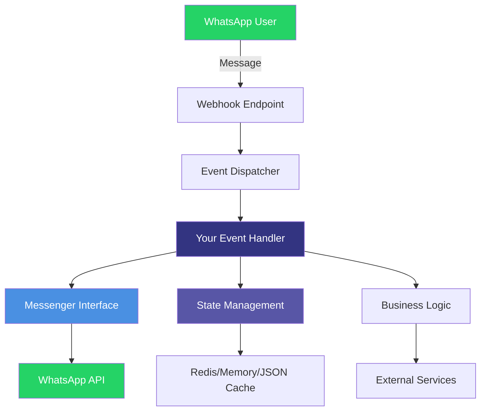

<div class="hero-section">
<div class="hero-content">

# Wappa - WhatsApp Business Framework

Modern Python library for building WhatsApp Business applications with clean architecture.


**Build WhatsApp bots in Python, fast.**

</div>
</div>

## What is Wappa?

Wappa is an **open source framework** for developing smart workflows, agents, and full chat applications through WhatsApp Business API. Built with modern Python practices and clean architecture principles.

## Key Features

<div class="grid cards" markdown>

-   :rocket: **Simple Import**

    ---

    Clean, minimal interface following Single Responsibility Principle

    ```python
    from wappa import Wappa, WappaEventHandler
    ```

-   :building_construction: **Clean Architecture**

    ---

    Interface-driven design with dependency injection and SOLID principles

    **Event-driven** • **Type-safe** • **Testable**

-   :iphone: **Complete WhatsApp Support**

    ---

    All message types, templates, interactive messages, and media handling

    **Text** • **Images** • **Buttons** • **Lists** • **Templates**

-   :wrench: **CLI Tools**

    ---

    Project scaffolding and development tools out of the box

    ```bash
    wappa init my-bot
    wappa dev app/main.py
    ```

-   :puzzle: **Plugin System**

    ---

    Extensible architecture with `WappaPlugin` and `WappaBuilder`

    **Redis** • **CORS** • **Rate Limiting** • **Custom Plugins**

-   :globe_with_meridians: **Multi-tenant Ready**

    ---

    Built for scaling across multiple WhatsApp Business numbers

    **Tenant isolation** • **Credential management** • **State separation**

</div>

## Quick Example

Get started with a simple echo bot in under 2 minutes:

=== "Simple Setup"

    ```python
    from wappa import Wappa, WappaEventHandler
    from wappa.webhooks import IncomingMessageWebhook

    class EchoHandler(WappaEventHandler):
        async def process_message(self, webhook: IncomingMessageWebhook) -> None:
            message_text = webhook.get_message_text()
            user_id = webhook.user.user_id
            
            await self.messenger.send_text(
                recipient=user_id,
                text=f"🔄 Echo: {message_text}"
            )

    app = Wappa()
    app.set_event_handler(EchoHandler())
    
    if __name__ == "__main__":
        app.run()
    ```

=== "Advanced Setup"

    ```python
    from wappa import WappaBuilder

    # Production-ready configuration
    app = (WappaBuilder()
           .with_whatsapp(
               token=os.getenv("WP_ACCESS_TOKEN"),
               phone_id=os.getenv("WP_PHONE_ID"),
               business_id=os.getenv("WP_BID")
           )
           .with_redis_cache("redis://localhost:6379")
           .with_cors_enabled()
           .with_rate_limiting(max_requests=100, window=60)
           .build())

    app.set_event_handler(MyAdvancedHandler())
    app.run()
    ```

=== "CLI Setup"

    ```bash
    # Initialize new project
    wappa init my-bot
    cd my-bot

    # Configure environment
    cp .env.example .env
    # Edit .env with your WhatsApp credentials

    # Run development server
    wappa dev app/main.py

    # Or run production server
    wappa prod app/main.py --workers 4
    ```

## Installation

=== "uv (Recommended)"

    ```bash
    # Create new project
    uv init my-wappa-project
    cd my-wappa-project

    # Add Wappa
    uv add wappa

    # Initialize project structure
    wappa init .
    ```

=== "pip"

    ```bash
    pip install wappa
    
    # Initialize new project
    wappa init my-wappa-project
    cd my-wappa-project
    ```

=== "Poetry"

    ```bash
    poetry new my-wappa-project
    cd my-wappa-project
    poetry add wappa
    
    # Initialize project structure  
    wappa init .
    ```

## Architecture Highlights



- **Event-Driven**: Webhook → Event Handler → Response
- **Type-Safe**: Full Pydantic models for all WhatsApp data structures  
- **FastAPI Core**: Built on modern async Python with automatic OpenAPI docs
- **Production Ready**: Docker support, Redis caching, structured logging

## What's Next?

<div class="grid cards" markdown>

-   **[🚀 Quick Start](quickstart.md)**

    Get a WhatsApp bot running in 5 minutes

-   **[📱 First App Tutorial](first-app.md)**

    Build a complete customer support bot

-   **[🏗️ Architecture Guide](concepts/architecture.md)**

    Understand clean architecture principles

-   **[📚 API Reference](api/wappa-core.md)**

    Complete API documentation

-   **[🛠️ Setup WhatsApp API](setup/whatsapp-setup.md)**

    Configure WhatsApp Business API

-   **[🚂 Deploy to Railway](deployment/railway.md)**

    Production deployment guide

</div>

---

## Community & Support

- **[GitHub Repository](https://github.com/sashanclrp/wappa)** - Source code and issues
- **[Example Projects](resources/examples.md)** - 6 complete example applications
- **[Migration Guide](resources/migration.md)** - Version updates and changelog

*Built with ❤️ by [Mimeia](https://mimeia.com) • Open Source • MIT License*