# Setup & Deployment

Getting your Wappa conversational application from development to production - the complete journey from local testing to serving real users at scale.

## What You'll Learn

This section covers everything you need to deploy and maintain production-ready WhatsApp conversational applications:

🔧 **[WhatsApp Setup](setup/whatsapp-setup.md)** - Get your WhatsApp Business API credentials and webhook configuration

🚀 **[Railway Deployment](deployment/railway.md)** - Deploy to Railway in 10 minutes with zero DevOps experience

✅ **[Production Checklist](deployment/production-checklist.md)** - Essential checks before going live with real users

## Development to Production Journey

Here's your path from idea to production:

```mermaid
graph LR
    A[💡 Idea] --> B[🔧 WhatsApp Setup]
    B --> C[💻 Local Development]
    C --> D[🧪 Testing]
    D --> E[🚀 Deploy]
    E --> F[✅ Production Checks]
    F --> G[📊 Monitor & Scale]
```



### Phase 1: WhatsApp Credentials
Get your WhatsApp Business API set up with Meta for Developers. This is the "boring but necessary" part that unlocks everything else.

### Phase 2: Local Development  
Build and test your conversational app locally using Wappa's development tools and test credentials.

### Phase 3: Production Deployment
Deploy to a cloud platform like Railway with proper environment variables and production credentials.

### Phase 4: Production Readiness
Run through our checklist to ensure your app is secure, monitored, and ready for real users.

## Quick Setup Path

**Never deployed before?** → Follow this sequence:

1. **[WhatsApp Setup](setup/whatsapp-setup.md)** - 20 minutes to get credentials
2. **[Railway Deployment](deployment/railway.md)** - 10 minutes to go live  
3. **[Production Checklist](deployment/production-checklist.md)** - 15 minutes of final checks

**Total time: ~45 minutes from zero to production** 🎯

## Deployment Options

### Recommended: Railway
- **Why?** Zero-config deployments, built-in Redis, automatic HTTPS
- **Best for**: Getting started quickly, indie developers, small teams
- **Cost**: Free tier available, pay-as-you-scale

### Other Options
- **Heroku**: Classic platform, easy setup
- **DigitalOcean App Platform**: Simple, predictable pricing  
- **AWS/GCP/Azure**: Maximum control, enterprise features
- **Self-hosted**: Your own servers with Docker

## Environment Management

Wappa apps work the same everywhere with proper environment configuration:

=== "Development"
    ```bash
    # Local development (.env file)
    WHATSAPP_TOKEN="temporary_token_24h"
    WHATSAPP_PHONE_ID="test_phone_id"
    WHATSAPP_BUSINESS_ID="test_business_id"
    ENVIRONMENT="development"
    CACHE_TYPE="memory"
    ```

=== "Production"
    ```bash
    # Production deployment (secure environment variables)
    WHATSAPP_TOKEN="permanent_system_user_token"
    WHATSAPP_PHONE_ID="real_phone_id"
    WHATSAPP_BUSINESS_ID="real_business_id"
    ENVIRONMENT="production"
    CACHE_TYPE="redis"
    REDIS_URL="redis://..."
    ```

## What Makes Production Different?

| Aspect | Development | Production |
|--------|-------------|------------|
| **Phone Number** | Test number (free) | Real business number |
| **Access Token** | Temporary (24h) | Permanent (system user) |
| **Recipients** | 5 test numbers | Unlimited real users |
| **Caching** | Memory/JSON file | Redis recommended |
| **SSL/HTTPS** | Optional (ngrok) | Required (platform handles) |
| **Monitoring** | Console logs | Structured logging + alerts |
| **Rate Limits** | Relaxed | Production limits apply |

## Ready to Deploy?

**First time?** → Start with [**WhatsApp Setup**](setup/whatsapp-setup.md) to get your credentials

**Already have credentials?** → Jump to [**Railway Deployment**](deployment/railway.md) for the fastest path to production

**Going enterprise?** → Review [**Production Checklist**](deployment/production-checklist.md) for security and compliance

---

*From localhost to global scale - we've got you covered! 🌍*