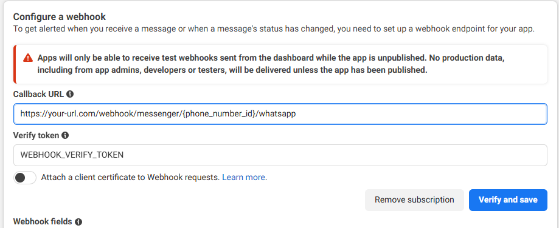
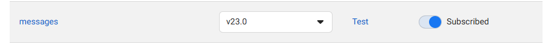

# WhatsApp Business API Setup

*The boring but necessary part - getting WhatsApp credentials*

Yes, this is the tedious part everyone wishes they could skip. But here's the thing: once you get through this setup (about 20 minutes), you'll have everything you need to build amazing conversational applications. And we'll walk you through every single step.

!!! tip "Quick Navigation"
    - **Just want to test?** Jump to [Development Setup](#development-setup)
    - **Ready for production?** Go to [Production Setup](#production-setup)
    - **Something not working?** Check [Common Gotchas](#common-gotchas)

## What You'll Get

After this setup, you'll have:

- **Phone Number ID**: Identifies your WhatsApp Business number
- **Business Account ID**: Your WhatsApp Business Account identifier  
- **Access Token**: Authentication for API calls
- **Webhook URL**: Where WhatsApp sends incoming messages

## Development Setup

*Perfect for testing and learning - no real phone number required*

### Step 1: Create Meta Developer Account

1. Go to [developers.facebook.com](https://developers.facebook.com)
2. Click **"Get Started"** and sign up with your Facebook account
3. Complete developer account verification (they'll ask for your phone number)

### Step 2: Create a Business App

1. In Meta for Developers dashboard, click **"Create App"**
2. Select **"Business"** as app type
3. Fill in your app details:
   - **App Name**: Something like "My Wappa App"
   - **App Contact Email**: Your email
   - **Business Account**: Create new or select existing

### Step 3: Add WhatsApp Product

1. In your app dashboard, find **"Add Products to Your App"**
2. Click **"Set Up"** on the WhatsApp card
3. You'll see the WhatsApp configuration panel

### Step 4: Get Your Test Credentials

In the WhatsApp > API Setup section, you'll see:

```bash
# These are your test credentials (good for 24 hours)
WHATSAPP_TOKEN="EAAxxxxx..."           # Temporary access token
WHATSAPP_PHONE_ID="123456789"         # Test phone number ID  
WHATSAPP_BUSINESS_ID="987654321"      # Test business account ID
```

!!! info "Test Environment Limits"
    - Temporary token expires in 24 hours
    - Can only send messages to 5 verified test numbers
    - Perfect for development and testing

### Step 5: Add Test Recipients

1. In the **"To"** field, click **"Manage phone number list"**
2. Add your phone number (you'll receive a verification code)
3. You can add up to 5 test numbers

**That's it for development!** You can now send your first message. But before you start coding, let's set up webhooks...

## Webhook Configuration

*Why webhooks matter and how Wappa handles them for you*

### Why You Need Webhooks

Think of webhooks as WhatsApp's way of telling your app: *"Hey, someone just sent you a message!"*

Without webhooks, your conversational app would be like having a phone that can make calls but never rings when someone calls you. Not very useful.



### The Good News: Wappa Handles This For You

Here's the beautiful part - **Wappa automatically creates and manages your webhook endpoints**. No manual webhook coding required!

When you start your Wappa app, you'll see something like this in the console:

```bash
=== WHATSAPP WEBHOOK URL ===
📍 Primary Webhook URL: https://your-domain.com/webhook/messenger/123456789/whatsapp
   • Use this single URL in WhatsApp Business settings
   • Handles both verification (GET) and webhooks (POST)  
   • Auto-configured with your WP_PHONE_ID from .env
=============================
```

### Step 1: Get Your Webhook URL

Just start your Wappa app in development:

```python
from wappa import Wappa
from app.master_event import MasterEventHandler

# Credentials come from .env file automatically
app = Wappa()
app.set_event_handler(MasterEventHandler())
app.run()  # Webhook URL will be displayed in console
```

For development, Wappa generates a local URL like:
```
http://localhost:8000/webhook/messenger/YOUR_PHONE_ID/whatsapp
```

### Step 2: Make Your Webhook Public (Development)

For development, use **ngrok** to expose your local webhook:

```bash
# Install ngrok if you don't have it
pip install pyngrok

# Run your Wappa app (it will show the webhook URL)
python app/main.py

# In another terminal, expose it publicly
ngrok http 8000
```

Copy the HTTPS URL (like `https://abc123.ngrok.io`) and combine with Wappa's webhook path:

**Your public webhook URL**:
```
https://abc123.ngrok.io/webhook/messenger/YOUR_PHONE_ID/whatsapp
```

### Step 3: Configure Webhook in Meta Dashboard

1. Go to WhatsApp > **Configuration** in your app dashboard
2. Click **"Edit"** next to Webhook
3. Fill in:
   - **Callback URL**: `https://abc123.ngrok.io/webhook/messenger/YOUR_PHONE_ID/whatsapp`
   - **Verify Token**: Any value you want (Wappa accepts any token for now)
4. Click **"Verify and Save"**

If verification succeeds, you'll see a green checkmark ✅

### Step 4: Subscribe to Messages

1. Scroll down to **"Webhook fields"**
2. Find the **"messages"** row  
3. Click **"Subscribe"**



!!! success "Webhook Magic"
    Wappa automatically handles webhook verification and message parsing. When someone messages your WhatsApp number, Wappa processes the webhook and calls your event handler with clean, structured data.

## Production Setup

*For real conversational applications with real users*

Production setup is more involved because Meta wants to make sure you're legitimate. Here's what changes:

### Requirements for Production

1. **Real Phone Number**: Must be a business phone number not associated with personal WhatsApp
2. **Business Verification**: Meta may require business documentation
3. **Permanent Access Token**: Generated through system users
4. **Production Environment**: Secure hosting with proper SSL

### Step 1: Add Your Production Phone Number

1. In WhatsApp > API Setup, click **"Add phone number"**
2. Enter your business phone number
3. Choose verification method:
   - **SMS**: Receive code via text
   - **Voice Call**: Receive code via automated call
4. Enter verification code

!!! warning "Phone Number Requirements"
    - Cannot be associated with personal WhatsApp
    - Must be a mobile number (some countries have restrictions)
    - Should be dedicated to your business use

### Step 2: Business Portfolio Setup

You need a **Meta Business Account** (formerly Business Manager):

1. Go to [business.facebook.com](https://business.facebook.com)
2. Click **"Create Account"** 
3. Add your business information:
   - Business name
   - Your name and work email
   - Business details

### Step 3: Create System User for Permanent Token

This is the trickiest part. You need a **system user** to generate tokens that don't expire:

1. In Business Settings, go to **Users** → **System Users**
2. Click **"Add System User"**
3. Set user details:
   - **Name**: Something like "Wappa API User"  
   - **Role**: **Admin** (required for full access)

### Step 4: Assign App Access to System User

1. Click your new system user
2. Go to **"Assign Assets"** → **"Apps"**
3. Select your WhatsApp app
4. Enable **"Full Control"**
5. Save changes

### Step 5: Generate Permanent Access Token

1. Still in system user settings, click **"Generate Token"**
2. Select your WhatsApp app
3. Choose token expiration: **"Never"** (permanent)
4. Select permissions:
   - ✅ `whatsapp_business_messaging`
   - ✅ `whatsapp_business_management`  
   - ✅ `business_management`
5. Click **"Generate Token"**

!!! warning "Token Security"
    Copy this token immediately and store it securely. You can only see it once. If you lose it, you'll need to generate a new one.

### Step 6: Configure App Information

Before going live, you need to complete your app configuration:

1. In your app dashboard, go to **App Settings** → **Basic**
2. Complete the required fields:
   - **App Icon**: Upload a professional logo/icon for your app
   - **Privacy Policy URL**: Link to your privacy policy (required)
   - **Terms of Service URL**: Link to your terms of service (required)
   - **Data Deletion Instructions URL**: Link explaining how users can delete their data (required)

!!! warning "Required URLs"
    Meta requires these URLs for compliance. Without them, your app cannot go live. Make sure these are real, accessible URLs that explain your data practices.

### Step 7: Update App to Live Mode

1. After completing app information, toggle **"App Mode"** from **Development** to **Live**
2. Your app is now ready for production users

!!! info "Business Verification Impact"
    - **Unverified Business**: Limited to 250 template messages per day
    - **Verified Business**: Automatically upgraded to 1,000 messages per day
    - **Higher Tiers**: Available based on business quality and behavior (can reach 100,000+ messages/day)
    
    Complete business verification through Meta Business Suite to increase your messaging limits.

## Environment Variables

Here's what your `.env` file should look like:

=== "Development"

    ```bash
    # Development environment (24-hour expiry)
    WHATSAPP_TOKEN="EAAxxxxx..."           # Temporary token from dashboard
    WHATSAPP_PHONE_ID="123456789012345"   # Test phone number ID
    WHATSAPP_BUSINESS_ID="987654321098765" # Test business account ID
    WEBHOOK_VERIFY_TOKEN="your_secret_token"
    ```

=== "Production"

    ```bash
    # Production environment (permanent)
    WHATSAPP_TOKEN="EAAxxxxx..."           # Permanent token from system user
    WHATSAPP_PHONE_ID="123456789012345"   # Your real phone number ID  
    WHATSAPP_BUSINESS_ID="987654321098765" # Your real business account ID
    WEBHOOK_VERIFY_TOKEN="your_secret_token"
    ```

## Common Gotchas

*Things that will save you hours of debugging*

### 1. Token Expiration Drama

**Problem**: Your app works for a day, then suddenly stops

**Solution**: Use permanent tokens for production. Development tokens expire every 24 hours.

```python
# This tells you if your token is about to expire
import requests

def check_token_validity(token):
    url = f"https://graph.facebook.com/me?access_token={token}"
    response = requests.get(url)
    
    if response.status_code != 200:
        print("❌ Token is invalid or expired")
        return False
    
    print("✅ Token is valid")
    return True
```

### 2. The First Message Trap

**Problem**: You can't send messages to users who haven't messaged you first

**Solution**: Users must initiate contact OR you must use approved message templates

```python
# Users must send any message first, like:
# "Hi", "Hello", "Start", anything...

# Only then can you send free-form replies for 24 hours
await messenger.send_text("Thanks for reaching out! How can I help?", phone_number)
```

### 3. Webhook Verification Fails

**Problem**: Meta can't verify your webhook URL

**Common causes**:
- Using HTTP instead of HTTPS (Meta requires SSL)
- Self-signed certificates (not supported)
- Firewall blocking Meta's servers
- Wrong verify token in code vs dashboard

**Solution**:
```python
# Make sure your verification logic is exact
@app.get("/webhook")
async def verify_webhook(request: Request):
    mode = request.query_params.get("hub.mode")
    token = request.query_params.get("hub.verify_token")
    challenge = request.query_params.get("hub.challenge")
    
    # Must match EXACTLY what you put in Meta dashboard
    if mode == "subscribe" and token == "your_exact_verify_token":
        return PlainTextResponse(challenge)
    
    return PlainTextResponse("Forbidden", status_code=403)
```

### 4. Wrong Phone Number Format

**Problem**: API returns "Invalid phone number" errors

**Solution**: Use international format without + or spaces

```python
# ❌ Wrong formats
phone = "+1 (555) 123-4567"
phone = "555-123-4567"

# ✅ Correct format  
phone = "15551234567"  # Country code + number, no symbols
```

### 5. Message Templates Got Rejected

**Problem**: WhatsApp rejects your custom message templates

**Common issues**:
- Using marketing language in utility templates
- Including URLs without proper formatting
- Missing required variables
- Wrong category selection

**Solution**: Start with the pre-approved "hello_world" template, then create simple, clear templates following [WhatsApp's guidelines](https://developers.facebook.com/docs/whatsapp/message-templates/guidelines).

### 6. App Stuck in Development Mode

**Problem**: Real users can't message your production app

**Solution**: Switch to Live mode in App Settings → Basic → App Mode

### 7. Webhook Not Receiving Messages

**Problem**: Your webhook endpoint isn't getting called

**Checklist**:
- ✅ App is in Live mode
- ✅ Webhook URL is publicly accessible via HTTPS
- ✅ Subscribed to "messages" field
- ✅ Endpoint returns 200 OK for all requests
- ✅ Phone number is properly verified

### 8. System User Token Approval Required

**Problem**: "We need someone else on this business to approve this request"

**Solution**: 
1. Go to Meta Business Suite
2. Navigate to **Requests** in left sidebar
3. Click **"Other requests"**
4. Another admin can approve the system user token

### 9. Rate Limiting Hell

**Problem**: Messages start failing after sending many messages

**Solution**: Implement proper rate limiting in your app

```python
import asyncio

async def send_with_rate_limit(messenger, message, phone):
    try:
        await messenger.send_text(message, phone)
    except RateLimitError:
        # Wait and retry
        await asyncio.sleep(1)
        await messenger.send_text(message, phone)
```

### 10. Webhook Payload Too Large

**Problem**: Large media files cause webhook timeouts

**Solution**: WhatsApp sends media URLs, not the files themselves. Download only when needed:

```python
# Don't download immediately - check size first
if message.media_url:
    # Check file size before downloading
    head_response = requests.head(message.media_url)
    size = int(head_response.headers.get('content-length', 0))
    
    if size < 10_000_000:  # 10MB limit
        # Download and process
        pass
    else:
        await messenger.send_text("File too large, please send smaller file", message.sender_phone)
```

### Production Webhook Setup

The webhook setup for production is identical - **Wappa still handles everything automatically**:

1. Deploy your Wappa app to your production environment
2. When it starts, it will display your production webhook URL:

```bash
=== WHATSAPP WEBHOOK URL ===
📍 Primary Webhook URL: https://your-domain.com/webhook/messenger/REAL_PHONE_ID/whatsapp
   • Use this URL in WhatsApp Business settings
   • Handles both verification (GET) and webhooks (POST)
   • Auto-configured with your production WP_PHONE_ID
=============================
```

3. Copy this URL and update your WhatsApp Business webhook configuration to point to your production domain

!!! tip "Production Webhook URL"
    The only difference between development and production webhooks is the domain:
    
    - **Development**: `https://abc123.ngrok.io/webhook/messenger/PHONE_ID/whatsapp`
    - **Production**: `https://your-domain.com/webhook/messenger/PHONE_ID/whatsapp`

## Testing Your Setup

Once everything is configured, test your setup:

```python
from wappa import Wappa
from app.master_event import MasterEventHandler

# Credentials loaded automatically from .env file
app = Wappa()
app.set_event_handler(MasterEventHandler())

# The webhook URL will be displayed when you run this
app.run()
```

If you can send and receive messages, congratulations! Your WhatsApp Business API is working.

## What's Next?

With your WhatsApp credentials ready:

- **Start Building**: Check out the [Quick Start](../quickstart.md) guide
- **Learn the Basics**: Understand [how Wappa works](../concepts/architecture.md)
- **See Examples**: Browse [example applications](../resources/examples.md)

!!! tip "Keep Your Credentials Safe"
    Add your `.env` file to `.gitignore` and never commit credentials to version control. Consider using environment variable services like Railway's built-in variables for production deployments.

---

*Still stuck? Ask for help in our [WhatsApp community](https://chat.whatsapp.com/GXXwfkP1ZoA6Ypjnb9mgiv).*